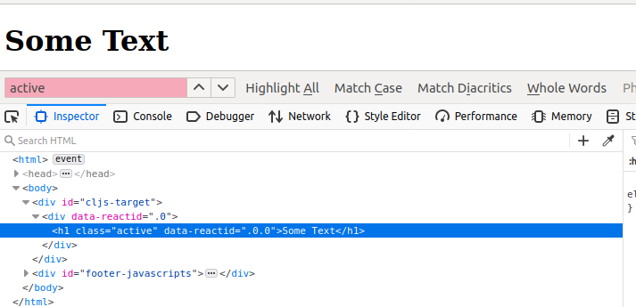
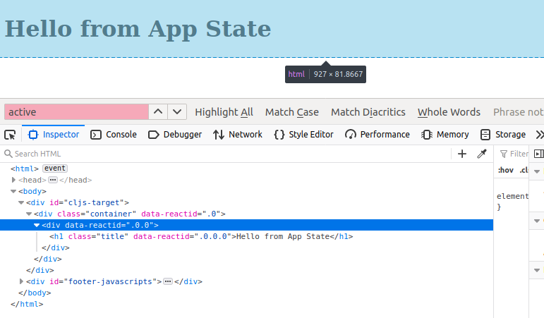

how tu build a clojure script from 0 to 1

---

##### about my clojure environment

the lein verson is:

```bash
user@ipp:~/Work/tmp/helloworld$ lein -v
Leiningen 2.9.3 on Java 11.0.7 OpenJDK 64-Bit Server VM
```

---

### $ CHAPTER 1 --   base work flow

# 1. create a simple clojure project

```bash
lein new helloworld
```

the result is:

```bahs
user@ipp:~/Work/tmp/helloworld$ tree .
.
├── CHANGELOG.md
├── doc
│   └── intro.md
├── LICENSE
├── project.clj
├── README.md
├── resources
├── src
│   └── helloworld
│       └── core.clj
└── test
    └── helloworld
        └── core_test.clj

6 directories, 7 files
```

# 2. modify  project.clj

add "main" and some dependencies to project.clj, in the end, the project.clj looks like:

```clojure
(defproject helloworld "0.1.0-SNAPSHOT"
  :description "FIXME: write description"
  :url "http://example.com/FIXME"
  :license {:name "EPL-2.0 OR GPL-2.0-or-later WITH Classpath-exception-2.0"
            :url "https://www.eclipse.org/legal/epl-2.0/"}
  :dependencies [[org.clojure/clojure "1.10.1"];1.10.1 is newest, after "lein new helloworld" runing,it added automatically
                 [org.clojure/clojurescript "1.10.741"];1.10.741 is newst in 2020年 06月 14日 星期日 18:01:54 CST
                 [reagent "1.0.0-alpha2"]];1.1.0-alpha2 is newst in 2020年 06月 14日 星期日 18:01:54 CST

  :cljsbuild {:builds [{:id "dev"
                        :source-paths ["src"]
                        ;:figwheel true
                        :compiler
                        {:optimizations :none
                         :output-to "resources/public/javascripts/dev.js"
                         :output-dir "resources/public/javascripts/cljs-dev/"
                         :pretty-print true
                         :source-map true}}]}
  :plugins [[lein-cljsbuild "1.1.8"];1.1.8 is newest in 2020年 06月 14日 星期日 18:01:54 CST
            #_[lein-figwheel "0.3.7"]]

  :repl-options {:init-ns helloworld.core}
  :main helloworld.core);add main as the entry 

```


# 3 .modify core.clj

change core.clj to this:

```clojure
(ns helloworld.core)

(defn -main[]
  "I don't do a whole lot."
  []
  (println  "Hello, World!"))
```


# 4. change the ext of core.clj 

change the ext of core.clj to core.cljc

why should we change it?

see [here](https://www.reddit.com/r/Clojure/comments/5ydj3i/help_regarding_clj_cljc_and_cljs/) as follows:

> .cljc just means that code, that can be compiled to both targets (JS and JVM/Java), will be compiled to both targets, without having to duplicate code.


# 5. make js dirs 

```bash
user@ipp:~/Work/tmp/helloworld$ cd resources/
user@ipp:~/Work/tmp/helloworld/resources$ mkdir -p public/javascripts/cljs-dev

```

# 6. test 'cljsbuild once'

now let's test if clojurescript can be built successfully.

```bash
user@ipp:~/Work/tmp/helloworld/resources$cd helloworld
user@ipp:~/Work/tmp/helloworld$ lein cljsbuild once dev

```

the output is:

```bash
user@ipp:~/Work/tmp/helloworld$ lein cljsbuild once dev
Compiling ClojureScript...
Compiling ["resources/public/javascripts/dev.js"] from ["src"]...
Successfully compiled ["resources/public/javascripts/dev.js"] in 1.572 seconds.
```

when you see this .it means the compile successful. It means that now you can build ClojureScript.

now ,let's keep going, to learn how to make a true ClojuerScript. see next step.

# 7.  add html

make a file named index.html locate in "resources/public/index.html".

the content in it is:

```html
<html>
    <head>
    </head>

    <body>
        <div id="cljs-target">
        </div>

        <div id="footer-javascripts">
            <script src="./javascripts/cljs-dev/goog/base.js"></script>
            <script src="./javascripts/dev.js"></script>
            <script>goog.require('helloworld.core')</script>           
        </div>
    </body>
</html>
```

pay attention, we suggest the "goog.require" statement must be at the end line of the div, or it will be an error in the runing time.

# 8. modify core.cljc

change the content of core.cljc to this:

```clojure
(ns helloworld.core)

(defn say-hello []
  #?(:clj (println "Hello from Clojure...")
     :cljs (js/console.log "Hello from ClojureScript...")))

(say-hello)
```

> the "#?" just like "if-else" .
>
> if run as clojure,it print "Hello from Clojure".
>
> if run as clojuerscript,it print"Hello from ClojureScript".  

# 9. run by 'cljsbuild once'

### 9.1 run as Clojure

in command line, change directory to working directory ("/home/srx/Work/tmp/helloworld").

run :

```bash
lein cljsbuild once dev
```

the output is :

```bash
srx@ipp:~/Work/tmp/helloworld$ lein cljsbuild once dev
Compiling ClojureScript...
Hello from Clojure...
Compiling ["resources/public/javascripts/dev.js"] from ["src"]...
Successfully compiled ["resources/public/javascripts/dev.js"] in 0.592 seconds.
srx@ipp:~/Work/tmp/helloworld$ lein cljsbuild once dev
Compiling ClojureScript...
srx@ipp:~/Work/tmp/helloworld$ 
```

ok,it print the "Hello from Clojuer...", it's ok.

# 9.2 run as ClojureScript

1. run cljsbuild

   open a new terminal, change directory to working directory ("/home/srx/Work/tmp/helloworld"), and run:
   
   ```bash
   lein cljsbuild once dev
   ```
   
2. start a server 

   we can start a simple server by python.

   open a new terminal, change directory to working directory ("/home/srx/Work/tmp/helloworld"), and then run:

   ```bash
   python3 -m http.server 8080
   ```

3. open the browser

   open the browser,input "localhost:8080"

4. redirect to index.html

   now you will see a directory structure, go to "resources/public/index.html".

5. check the result

    then you can open the browser console  by F12, you will see the print of "Hello from ClojureScript".

   

# 10. run by 'cljsbuild auto'

you dont need to build you code every time,so just use :

```bash
lein cljsbuild auto dev
```

when you change the code,it will compile automatically.


let's have a look to see the base work flow:

1. do a little change to core.cljc   

   let's do a little change in core.cljc. we change "js/console.log" to "js/alert",so we can check the result more easily. so the core.cljc looks like:

   ```clojure
   (ns helloworld.core)
   
   (defn say-hello []
     #?(:clj (println "Hello from Clojure...")
        :cljs (js/alert "Hello from ClojureScript...")))
   
   (say-hello)
   ```

2. run cljsbuild auto

   ```
   lein cljsbuild auto dev
   ```

3. start a server

  ```
   python -m http.server 8080
  ```
4.  open browser

   open browser,rediret to :
   
   ```
   localhost:8080/resources/public/index.html
   ```
   
   you will see an alert window show the message "Hello from ClojuerScript". 


__Ok,above all is a very base clojures scirpt work flow.__


---


### $CHAPTER 2 -- Middle usage


# 1. how to add a react to your project

### 1. find a script src address of Reactjs. 

 google "React cdn" , or go to ofiicial web in React , then find "cdn" to find version"0.14.7" , and find the cdnjs's source address,for example ,it is like below:

```
https://cdnjs.cloudflare.com/ajax/libs/react/0.14.7/react.js
```

so, add this as script to "index.html," it like:

```html
            <script src="https://cdnjs.cloudflare.com/ajax/libs/react/0.14.7/react.js"></script>
```

so the index.html looks like :

```html
<html>
    <head>
    </head>

    <body>
        <div id="cljs-target">
        </div>

        <div id="footer-javascripts">
            <script src="https://cdnjs.cloudflare.com/ajax/libs/react/0.14.7/react.js"></script>
            <script src="./javascripts/cljs-dev/goog/base.js"></script>
            <script src="./javascripts/dev.js"></script>
            <script>goog.require('helloworld.core')</script>           
        </div>
    </body>
</html>
```

and the core.cljc looks like:

```clojure
(ns helloworld.core)

(defn say-hello []
  #?(:clj (println "Hello from Clojure...")
     :cljs (js/console.log  js/React)))

(say-hello)
```

then start a server by python ,check the localhost ,and F12 you will see the React Object. 

It means you add React to your project successfully.


__*TIPS*__:

you can only maintain the :

```clojure
#?(:cljs (js/console.log  js/React))
or 
(js/console.log  js/React)
```

at the same time,change the ext of "core.cljc" to "core.cljs",

so, the core.cljs looks like:

```clojure
## core.cljs !!!
## core.cljs !!!


(ns helloworld.core
  
  (:require [reagent.core :as reagent ]))

(defn multiply-numbers [x y]
  (* x y ))
(defn say-hello []  
     (js/console.log  (multiply-numbers 5 10)))

(say-hello) 
```

OR "core.cljc":

```clojure
# core.cljc  !!
# core.cljc  !!

(ns helloworld.core
  
  (:require [reagent.core :as reagent ]))

(defn multiply-numbers [x y]
  (* x y ))

(defn say-hello []
  #?(:cljs (js/console.log  (multiply-numbers 5 10))))

(say-hello) 
```


# 2. how to use Reagent in ClojureScript

add require in core.cljs, :

```clojure
 (:require [reagent.core :as reagent ]
```

so the core.cljs looks like:

```clojure
(ns helloworld.core
  
  (:require [reagent.core :as reagent ]))

(defn multiply-numbers [x y]
  (* x y ))

(defn say-hello []
   (js/console.log  (multiply-numbers 5 10)))

(say-hello) 
```

then it's ok. 

start the server by pyhton ,then you can see the resutlt in browser' s consooe log.


# 3. how to use ClojureScript and React to add html element

### eg-1  base tag

for a play, let's change the version of react from the newst 1.1.0-alpha2 to 0.5.0, so the project.clj will look like :

```clojure
(defproject helloworld "0.1.0-SNAPSHOT"
  :description "FIXME: write description"
  :url "http://example.com/FIXME"
  :license {:name "EPL-2.0 OR GPL-2.0-or-later WITH Classpath-exception-2.0"
            :url "https://www.eclipse.org/legal/epl-2.0/"}
  :dependencies [[org.clojure/clojure "1.10.1"];1.10.1 is newest, after "lein new helloworld" runing,it added automatically
                 [org.clojure/clojurescript "1.10.741"];1.10.741 is newst in 2020年 06月 14日 星期日 18:01:54 CST
                 [reagent "0.5.0"]];1.1.0-alpha2 is newst in 2020年 06月 14日 星期日 18:01:54 CST

  :cljsbuild {:builds [{:id "dev"
                        :source-paths ["src"]
                        ;:figwheel true
                        :compiler
                        {:optimizations :none
                         :output-to "resources/public/javascripts/dev.js"
                         :output-dir "resources/public/javascripts/cljs-dev/"
                         :pretty-print true
                         :source-map true}}]}
  :plugins [[lein-cljsbuild "1.1.8"];1.1.8 is newest in 2020年 06月 14日 星期日 18:01:54 CST
            #_[lein-figwheel "0.3.7"]]

  :repl-options {:init-ns helloworld.core}
  :main helloworld.core);add main as the entry 
```

and change the content of core.cljs to:

```clojure
(ns helloworld.core
  
  (:require [reagent.core :as reagent ]))

(defn app[]
  [:h1 {:class "title"} "Hello from a Clojure data strcture... not JSX... wow"])

(reagent/render  [app] (js/document.querySelector "#cljs-target"))
```

and then:

```
lein cljsbuild auto dev
```

in another terminal:

```
python -m http.server 8080
```

and let's view :

```html
http://localhost:8080/resources/public/index.html
```

we can see the sentence on the web page.

```
Hello from a Clojure data strcture... not JSX... wow
```


### eg-2  loop with tag

change the core.cljs to :

```clojure
(ns helloworld.core
  
  (:require [reagent.core :as reagent ]))


(defn app[]
  [:div {}
   (for [i (range 10)]
       [:h1 i])])

(reagent/render  [app] (js/document.querySelector "#cljs-target"))
```

you can see the div content in browser.


### eg-3 if-else with tag

core.cljs:

```clojure
(ns helloworld.core
  
  (:require [reagent.core :as reagent ]))


(defn app[]
  [:div {}
    [:h1 {:class (if (> 55 13) "active")} "Some Text"]])

(reagent/render  [app] (js/document.querySelector "#cljs-target"))
```

the "#cljs-target" in the code is the name of a div in "index.html".

you can see a class named "active" in h1 element. as the image shows.



if you change (> 55 13) to (> 55 63) ,then there will be NO class named "atcive".


### eg-4  call a variable

core.cljs:

```clojure
(ns helloworld.core
  
  (:require [reagent.core :as reagent ]))

(def app-state 
  (reagent/atom 
   {:message "Hello from App State"}))

(defn app[]
  [:div {}
    [:h1 {:class (if (> 55 13) "active")} (:message @app-state)]])

(reagent/render  [app] (js/document.querySelector "#cljs-target"))
```

then  view :

```
http://localhost:8080/resources/public/index.html
```

you will see the conent:

```
Hello from App State
```


### eg-5 show sth in div

core.cljs:

```
(ns helloworld.core
  
  (:require [reagent.core :as reagent ]))

(def app-state 
  (reagent/atom 
   {:message "Hello from App State"}))

(defn app[]
  [:div {}  "Some text from VSCode"])
    
(reagent/render  [app] (js/document.querySelector "#cljs-target")) 
```

then you can see :

```
Some text from VSCode
```


### eg-6  js/timmer

core.cljs:

```clojure
(ns helloworld.core
  
  (:require [reagent.core :as reagent ]))

(def app-state 
  (reagent/atom 
   {:message "Hello from App State"}))

(defn app[]
  [:div {}  (:message @app-state)])
    

(js/setTimeout
  (fn [] (swap! app-state assoc-in [:message] "New Message... ")) 2000 )


(reagent/render  [app] (js/document.querySelector "#cljs-target")) 
```

when you run this, 2 seconds later, the text will changed from :

```
Hello from App Stat
```

to:

```
New Message... 
```


### eg-7 tag nested

core.cljs:

```clojure
(ns helloworld.core
  
  (:require [reagent.core :as reagent ]))

(def app-state 
  (reagent/atom 
   {:message "Hello from App State"}))

(defn header [message]
  [:div {}
   [:h1 {:class "title"} message]])

(defn app[]
  [:div {:class "container"}  
   [header (:message @app-state)]])
    

(reagent/render  [app] (js/document.querySelector "#cljs-target")) 
```

then ,the browser's elment will look like:



we can see the class "title" and "container".


