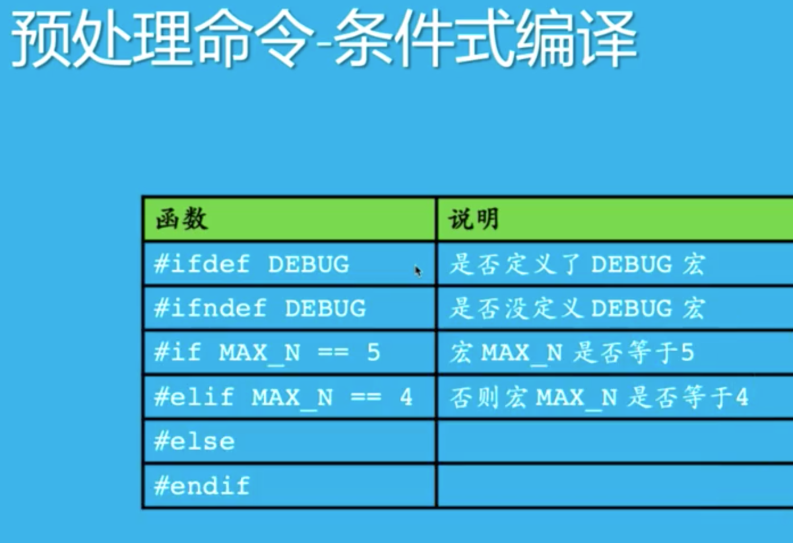
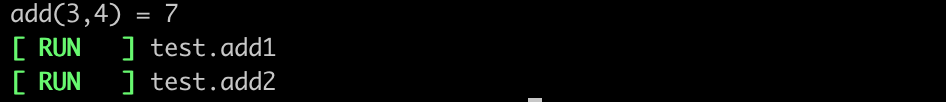
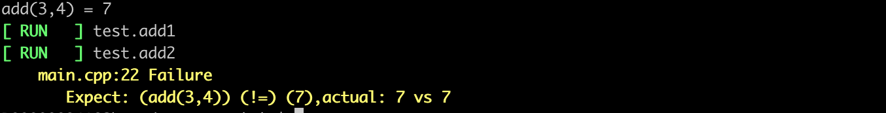

#  books to read

<<C++对象模型>>

# compile and link

编译：语法检查

链接：各符号，定义的链接，查找

## nm 

```
nm -C xxx.o

U menas outside to look for defination
[numbers] T means the function defination is in the .o file 
```


## errors

### 1. undefinded 

the below two lines are the same:

>  undefined reference to 'xxx' (in linux os)

> undefined symbols for architecture x86_64 (in mac os)

the error in happend in link stage.


__EXAMPLE:__

```C++
// main.cpp
#include <iostream>

using namespace std;

int add(int a,int b);

int main()
{
	printf("the add result %d\n",add(3,4));
	return 0;
}

```

then we build it:

```bash
g++ -c main.cpp 
```

a main.o will generated. and no errror occur.

then we do link:

```
g++ main.o
```

the error  occur:

```bash
$ g++ main.o
/usr/bin/ld: main.o: in function `main':
main.cpp:(.text+0x13): undefined reference to `add(int, int)'
collect2: error: ld returned 1 exit status
```

the link faiked .

__CONCLUSION OF THE EXAMPLE__:

the code can build successful, but will failed when link.

__CHECK *.o file__:

```bash
nm -C main.o
```

the output is:

```bash
                 U __cxa_atexit
                 U __dso_handle
                 U _GLOBAL_OFFSET_TABLE_
000000000000007e t _GLOBAL__sub_I_main
0000000000000000 T main
                 U printf
                 U add(int, int)
0000000000000031 t __static_initialization_and_destruction_0(int, int)
                 U std::ios_base::Init::Init()
                 U std::ios_base::Init::~Init()
0000000000000000 r std::piecewise_construct
0000000000000000 b std::__ioinit
```

the "T" aftet the numbers such as "00000000000" means the function defination is in the file, so the compiler dont need to look for the defination of the function outside. but the "U" means the compiler need to look for the function outside.

__SOLVE THE PROBLEM of the EXAMPLE__:

add a file named other.cc:

```c++
// other.cc

int add(int a,int b)
{
	return a+b;
}
```

and then:

```c++
g++ -c other.cc
```

now , a other.o generated,

we can check other.o and main.o:

"nm -C main.o":

```
                 U __cxa_atexit
                 U __dso_handle
                 U _GLOBAL_OFFSET_TABLE_
000000000000007e t _GLOBAL__sub_I_main
0000000000000000 T main
                 U printf
                 U add(int, int)
0000000000000031 t __static_initialization_and_destruction_0(int, int)
                 U std::ios_base::Init::Init()
                 U std::ios_base::Init::~Init()
0000000000000000 r std::piecewise_construct
0000000000000000 b std::__ioinit
```


"nm -C other.o":

```
0000000000000000 T add(int, int)
```

so , the two object files can match, because the funciton "add" is "U" in main.o but "T" in other.o , so link is successful.

### 2. multiple definition

the below two lines are the same:

> multiple definition of 'xxx'  (linux)

> duplicate symbol for architecture x86_64 (mac)

the error happend when define one function in two *.o , so when link them togther, the error occures. 


__EXAMPLE:__

main.cpp :

```c++
// main.cpp

#include <iostream>

using namespace std;

int add(int a,int b)
{
	return a+b;
}

int main()
{
	printf("the add result %d\n",add(3,4));
	return 0;
}

```

other.cpp

```c++
// other.cc
int add(int a,int b)
{
	return a+b;
}
```


build them to obj files:

```bash
$ g++ -c main.cpp
$ g++ -c other.cc
```

link them:

```bash
$ g++ main.o other.o
```

```
/usr/bin/ld: other.o: in function `add(int, int)':
other.cc:(.text+0x0): multiple definition of `add(int, int)'; main.o:main.cpp:(.text+0x0): first defined here
collect2: error: ld returned 1 exit status
```

why failed, because the func "add" defined in two obj files.

### multidefination by *.h

add a other.h file:

```c++
#ifndef _OTHER_H
#define _OTHER_H

int add(int,int);

int f(int x){
	return x;
}

#endif
```

modify the main.cpp as  below:

```c++
#include <iostream>

#include "other.h" //add this line

using namespace std;


int main()
{
	printf("f(6) = %d\n",f(6));   // add this line
	printf("the add result %d\n",add(3,4));// %d helps the compiler to check syntax
	return 0;
}
```

modify the other.cc:

```c++
#include "other.h"

int add(int a,int b)
{  
	f(123);
	return a+b;
}
```

build them to obj files:

```bash
$ g++ -c main.cpp
$ g++ -c other.cc
```

link them:

```bash
$ g++ main.o other.o
```

```bash
/usr/bin/ld: other.o: in function `f(int)':
other.cc:(.text+0x0): multiple definition of `f(int)'; main.o:main.cpp:(.text+0x0): first defined here
collect2: error: ld returned 1 exit status
```

__CONCLUSTION OF the EXAMPLE:__

```
dont defination functions in .h file
```

## googletest frame

after link, the object files can generate executive file , __OR__ static link file(*.a).

main.cpp:

```c++
// main.cpp

#include <iostream>

#include <gtest/gtest.h>

using namespace std;
//int add (int a, int b)
//{
//  return a+b;
//}
TEST(test,add1){
	EXPECT_EQ(add(3,4),7);
    EXPECT_NE(add(3,4),6);
	EXPECT_LT(add(3,4),8);
	EXPECT_LE(add(3,4),7);
	EXPECT_GT(add(3,4),6);
	EXPECT_GE(add(3,4),7);
}

TEST(test,add2){
	EXPECT_EQ(add(3,4),7);
    EXPECT_NE(add(3,4),7);
	EXPECT_LT(add(3,4),8);
	EXPECT_LE(add(3,4),7);
	EXPECT_GT(add(3,4),6);
	EXPECT_GE(add(3,4),7);
}


int main()
{
	printf("add(3,4) = %d\n",add(3,4));   // add this line
	return RUN_ALL_TESTS();
}
```

build :

```bash
$ g++ -c main.cpp 
main.cpp:3:10: fatal error: gtest/gtest.h: No such file or directory
    3 | #include <gtest/gtest.h>
      |          ^~~~~~~~~~~~~~~
compilation terminated.
```

so ,add the "I" options to find the include directory;

```bash
$ g++ -I/home/ipp/Work/supporters/googletest/googletest/include -c main.cpp
```

then main.o generated.

then link the main.o:

```bash
$ g++ main.o
```

the output is :

```bash
/usr/bin/ld: main.o:(.data.rel.ro._ZTV14test_add2_Test[_ZTV14test_add2_Test]+0x20): undefined reference to `testing::Test::SetUp()'
/usr/bin/ld: main.o:(.data.rel.ro._ZTV14test_add2_Test[_ZTV14test_add2_Test]+0x28): undefined reference to `testing::Test::TearDown()'
/usr/bin/ld: main.o: in function `test_add2_Test::~test_add2_Test()':
main.cpp:(.text._ZN14test_add2_TestD2Ev[_ZN14test_add2_TestD5Ev]+0x26): undefined reference to `testing::Test::~Test()'
/usr/bin/ld: main.o:(.data.rel.ro._ZTV14test_add1_Test[_ZTV14test_add1_Test]+0x20): undefined reference to `testing::Test::SetUp()'
/usr/bin/ld: main.o:(.data.rel.ro._ZTV14test_add1_Test[_ZTV14test_add1_Test]+0x28): undefined reference to `testing::Test::TearDown()'
/usr/bin/ld: main.o: in function `test_add1_Test::~test_add1_Test()':
main.cpp:(.text._ZN14test_add1_TestD2Ev[_ZN14test_add1_TestD5Ev]+0x26): undefined reference to `testing::Test::~Test()'
/usr/bin/ld: main.o:(.data.rel.ro._ZTI14test_add2_Test[_ZTI14test_add2_Test]+0x10): undefined reference to `typeinfo for testing::Test'
/usr/bin/ld: main.o:(.data.rel.ro._ZTI14test_add1_Test[_ZTI14test_add1_Test]+0x10): undefined reference to `typeinfo for testing::Test'
/usr/bin/ld: main.o: in function `test_add2_Test::test_add2_Test()':
main.cpp:(.text._ZN14test_add2_TestC2Ev[_ZN14test_add2_TestC5Ev]+0x18): undefined reference to `testing::Test::Test()'
/usr/bin/ld: main.o: in function `test_add1_Test::test_add1_Test()':
main.cpp:(.text._ZN14test_add1_TestC2Ev[_ZN14test_add1_TestC5Ev]+0x18): undefined reference to `testing::Test::Test()'
collect2: error: ld returned 1 exit status
...
...
...
```

then add the lib source as below:

```bash
$ g++ -L/home/ipp/Work/supporters/googletest/build/lib main.o -lgtest -lpthread
```

## Colorful printf function

__config__:

```bash
\033[A1;A2;A3;...AN m
```


__EXAMPLE 1:__

mian.cpp:

```c++
// main.cpp

#include <iostream>

int main()
{
	printf("\033[1;31;40mhello world\n");
	printf("\033[1;31;42mhello world\033[0m\n");//"\033[0m" close the color mode
	printf(" this line won't change color\n");
		
	return 0;
}
```

we can write a Makefile to build the cpp:

Makefile:

```cmake
all:
	g++ -std=c++11  main.cpp
```

then we run make:

```bash

$ make
```

the output is:


__EXAMPLE 2:__

main.cpp:

```c++
#include <iostream>

int main()
{
	printf("\033[0;1;31;40mhello world\n");//"0" to clear setting before
	printf("\033[0;34mhello world\n");//"only overwrite 34 color, the other color are default"
	printf("\033[0;35mhello\n");
	printf(" this line will change color although no color setting in this line\n");
	printf("\033[0;36mhello\033[0m\n");
	printf(" this line won't change color because color mode close in the end of last line\n");	
	return 0;
}
```


the output is:


## Debug print log

### 1. predeal command

Symbol:"#", the symbol means this the group of predeal, it contains many members , MACRO is one of these.

```c++
#include

#define
```

### 2. Macro withour params

>  宏定义是让编译器帮我们写代码

```c++
# define PI 3.1415926
```


### 3. Macro with params

>  宏定义是让编译器帮我们写代码

```c++
# define S(a,b) a*b
```

if main.cpp is:

```c++
//main.cpp

#include <iostream>
int main()
{
  printf("result:%d",S(3+6,4)); 
  return 0;
}
```

the value is "27" rather than "36". why? use g++ -E to check:

```c++
g++ -E main.cpp
```

the output is :

```c++
...
...

int main()
{
  printf("result:%d",3+6*4);
  return 0;
}
```

so we know, the Macro is just __REPLACE__ .

__Examle__:

the main.cpp:

```c++
// main.cpp

#include <iostream>

# define S(a,b) a*b

int main()
{
  printf("result:%d",S(3+6,4));
  int n;
  S(int,p)=&n;
  return 0;
}
```

it can build successful, 

and the output of :

```c++
g++ -E main.cpp
```

 is:

```c++
int main()
{
  printf("result:%d",3+6*4);
  int n;
  int*p=&n;
  return 0;
}
```

Why? Because the Macro REPLACE the S(int,p)-->int*p

__TIPS__:

> c语言----预处理--->待编译源码（最后的源码）----编译----->目标文件----链接----->可执行程序


__TIPS:__

The macro in compiler:


 __Example:__

mian.cpp:

```c++
// main.cpp


#include <iostream>

# define S(a,b) a*b

int main()
{
  printf("result:%d",S(3+6,4));
  int n;
  S(int,p)=&n;

  printf("__DATE__ = %s\n", __DATE__);//string type.   date
  printf("__TIME__ = %s\n", __TIME__);//string type.   time
  printf("__FILE__ = %s\n", __FILE__);//string type.   filename
  printf("__LINE__ = %d\n", __LINE__);//int    type.   line number
  printf("__func__ = %s\n", __func__);//string type.   current function name, only the name
  printf("__PRETTY_FUNCTION__ = %s\n", __PRETTY_FUNCTION__);  // string type.    whole current function name, including return value and params
  return 0;
}
```

The output is:

```bash
result:27__DATE__ = Sep 13 2020
__TIME__ = 12:52:06
__FILE__ = main.cpp
__LINE__ = 18
__func__ = main
__PRETTY_FUNCTION__ = int main()
```

The macro is built in  待编译源码， so the value of the input will not change in later time, beause the info in the macro is built in the 待编译源码, it's won't changed in runnig time.

What's the usage of this character?

> 1. 程序的版本的校验、发布时间校验（如 \___TIME___的值是在编译时已写死的信息）
> 2. 检查程序的编译性能

###  macro function (with param list)

>  宏定义是让编译器帮我们写代码

__Example:__

main.cpp:

```c++
// main.cpp

#include <iostream>
using namespace std;

#define S(a,b) a*b

#define LOG(frm,args...) { \
	printf("[%s : %s : %d] ",__FILE__,__func__,__LINE__); \
	printf(frm,##args); \
	printf("\n"); \
}
// the "args..."" is the param list, it can be 0,1,2,...n params
//  the "args..."" can be written as "abcs...","abes...","aaa...","bbb...",etc. 


int main()
{
  printf("result:%d",S(3+6,4));
  int n;
  S(int,p)=&n;

  printf("__DATE__ = %s\n", __DATE__);//string type.   date  when compiling this file
  printf("__TIME__ = %s\n", __TIME__);//string type.   time  when compiling this file
  printf("__FILE__ = %s\n", __FILE__);//string type.   filename
  printf("__LINE__ = %d\n", __LINE__);//int    type.   line number
  printf("__func__ = %s\n", __func__);//string type.   current function name, only the name
  printf("__PRETTY_FUNCTION__ = %s\n", __PRETTY_FUNCTION__);  // string type.    whole current function name, including return value and params

  LOG("hello world");
  int n1;
  LOG("hello Mars");
  return 0;
}
```


the output is :

```bash
result:27__DATE__ = Sep 13 2020
__TIME__ = 14:00:19
__FILE__ = main.cpp
__LINE__ = 29
__func__ = main
__PRETTY_FUNCTION__ = int main()
[main.cpp : main : 33] hello world
[main.cpp : main : 35] hello Mars
```


__Example:__ add a switch to open LOG or NOT

change original LOG macro from:

```c++
#define LOG(frm,args...) { \
	printf("[%s : %s : %d] ",__FILE__,__func__,__LINE__); \
	printf(frm,##args); \
	printf("\n"); \
}
```

To:

```c++
int debug=1;

#define LOG(frm,args...)  do{ \
  if(!debug) break; \
	printf("[%s : %s : %d] ",__FILE__,__func__,__LINE__); \
	printf(frm,##args); \
	printf("\n"); \
}while(0)
```

__TIPS__: write the function in a while loop, so we can break ;).  but it's not the best solution, see below.


__Example__: add a switch to open LOG or NOT use "#ifdef"




__We can use 条件编译 to do 代码剪裁.__

main.cpp:

```c++
using namespace std;

#define S(a,b) a*b

#define DEBUG // open/cloes the LOG switch

#ifdef DEBUG

#define LOG(frm,args...)  { \
	printf("[%s : %s : %d] ",__FILE__,__func__,__LINE__); \
	printf(frm,##args); \
	printf("\n"); \
}

#else

#define LOG(frm,args...)

#endif


int main()
{
  printf("result:%d",S(3+6,4));
  int n;
  S(int,p)=&n;

  printf("__DATE__ = %s\n", __DATE__);//string type.   date  when compiling this file
  printf("__TIME__ = %s\n", __TIME__);//string type.   time  when compiling this file
  printf("__FILE__ = %s\n", __FILE__);//string type.   filename
  printf("__LINE__ = %d\n", __LINE__);//int    type.   line number
  printf("__func__ = %s\n", __func__);//string type.   current function name, only the name
  printf("__PRETTY_FUNCTION__ = %s\n", __PRETTY_FUNCTION__);  // string type.    whole current function name, including return value and params

  LOG("hello world");
  int n1;
  LOG("hello Mars");
  return 0;
}
```

the output is not the Best solution because you need to change the code inner. see a better solution below.

__Example__: Use "-D" compile solution and "#ifdef".

main.cpp:

```c++
using namespace std;

#define S(a,b) a*b

#ifdef DEBUG

#define LOG(frm,args...)  { \
	printf("[%s : %s : %d] ",__FILE__,__func__,__LINE__); \
	printf(frm,##args); \
	printf("\n"); \
}

#else

#define LOG(frm,args...)

#endif


int main()
{
  printf("result:%d",S(3+6,4));
  int n;
  S(int,p)=&n;

  printf("__DATE__ = %s\n", __DATE__);//string type.   date  when compiling this file
  printf("__TIME__ = %s\n", __TIME__);//string type.   time  when compiling this file
  printf("__FILE__ = %s\n", __FILE__);//string type.   filename
  printf("__LINE__ = %d\n", __LINE__);//int    type.   line number
  printf("__func__ = %s\n", __func__);//string type.   current function name, only the name
  printf("__PRETTY_FUNCTION__ = %s\n", __PRETTY_FUNCTION__);  // string type.    whole current function name, including return value and params

  LOG("hello world");
  int n1;
  LOG("hello Mars");
  return 0;
}
```

and then we add "-D" option to open a macro.

```c++
$ g++ -DDEBUG main.cpp
```

it will open the DEBUG switch.

##  Write a test frame to mimic googletest frame

__Example1:__

Include/haizei/htest.h:

```c++
#ifndef _HTEST_H
#define _HTEST_H

#define EXPECT_EQ(a,b) { \
	if(!((a)==(b))){ \
		printf("%s","error"); \
	} \
}
#define EXPECT_NE(a,b) { \
	if(!((a)!=(b))){ \
		printf("%s","error"); \
	} \
}
#define EXPECT_GT(a,b) { \
	if(!((a)>=(b))){ \
		printf("%s","error"); \
	} \
}
#define EXPECT_LT(a,b) { \
	if(!((a)<=(b))){ \
		printf("%s","error"); \
	} \
}
#endif
```

But it's not good because of too much duplicated logic codes. so it's junk code.

see a better version below.


__Example2__:

Include/haizei/htest.h:

```c++
#ifndef _HTEST_H
#define _HTEST_H

#define EXPECT(a,comp,b) { \
	if(!((a) comp (b))){ \
		printf("%s","error"); \
	} \
}

#define EXPECT_EQ(a,b) EXPECT(a,==,b)
#define EXPECT_NE(a,b) EXPECT(a,!=,b)
#define EXPECT_LT(a,b) EXPECT(a,<,b)
#define EXPECT_LE(a,b) EXPECT(a,<=,b)
#define EXPECT_EQ(a,b) EXPECT(a,>,b)
#define EXPECT_GR(a,b) EXPECT(a,>=,b)


#endif
```

we can add some COLOR LOG message:

```c++
#define RED(msg) "\033[0;1;31m" msg "\033[0m"
#define GREEN(msg) "\033[0;1;32m" msg "\033[0m"
#define YELLOW(msg) "\033[0;1;33m" msg "\033[0m"
#define BLUE(msg) "\033[0;1;34m" msg "\033[0m"
```

But it's not good because of too much duplicated logic codes. so it's junk code.

see a better version below.

```c++
#define COLOR(msg,code) "\033[0;1;" #code "m" msg "\033[0m"  // "#code" transfer "code" to a string

#define RED(msg)     COLOR(msg,31)
#define GREEN(msg)   COLOR(msg,32)
#define YELLOW(msg)  COLOR(msg,33)
#define BLUE(msg)    COLOR(msg,34)
```

Well donw.

Now the htest.h will looks like below.

```c++
//include/haizei/htest.h

#ifndef _HTEST_H
#define _HTEST_H

#define COLOR(msg,code) "\033[0;1;" #code "m" msg "\033[0m"  // "#code" transfer "code" to a string

#define RED(msg)     COLOR(msg,31)
#define GREEN(msg)   COLOR(msg,32)
#define YELLOW(msg)  COLOR(msg,33)
#define BLUE(msg)    COLOR(msg,34)


#define EXPECT(a,comp,b) { \
	if(!((a) comp (b))){ \
		printf("%s","error"); \
	} \
}

#define EXPECT_EQ(a,b) EXPECT(a,==,b)
#define EXPECT_NE(a,b) EXPECT(a,!=,b)
#define EXPECT_LT(a,b) EXPECT(a,<,b)
#define EXPECT_LE(a,b) EXPECT(a,<=,b)
#define EXPECT_GR(a,b) EXPECT(a,>,b)
#define EXPECT_GE(a,b) EXPECT(a,>=,b)


#endif
```

Ok, Now let's write a test code.

main.cpp

```c++
#include <iostream>
#include <include/haizei/htest.h>

using namespace std;


int main()
{
    printf("hello world\n");
    printf(RED("hello world\n"));
    printf(GREEN("hello world\n"));
    printf(YELLOW("hello world\n"));
    printf(BLUE("hello world\n"));
    return 0;
}
```

```c++
$ g++ -I./ main.cpp
```

__TIPS:__  a difference between "<>" and ""

```c++  
#include <include/haizei/htest.h>    ==> g++ -I./ main.cpp
#include "include/haizei/htest.h"    ==> g++ main.cpp
```

### 5. use attribute to registry a function

if we add the attribute to a function , then the funciton will execute before main function.

__Example__:

```c++
#include <iostream>
using namespace std;

__attribute__((constructor))
void test()
{
	printf("in test : hello world\n");
}

int main()
{
	printf("in main : hello world\n");
	return 0;
}
```

the output is:

````bash
in test : hello world
in main : hello world
````

__Example:__

```c++
//main.cpp

#include <iostream>

#include <include/haizei/htest.h>

using namespace std;

int add(int a, int b){
    return a+b;
}

TEST(test,add1){
	EXPECT_EQ(add(3,4),7);
        EXPECT_NE(add(3,4),6);
	EXPECT_LT(add(3,4),8);
	EXPECT_LE(add(3,4),7);
	EXPECT_GT(add(3,4),6);
	EXPECT_GE(add(3,4),7);
}

TEST(test,add2){
	EXPECT_EQ(add(3,4),7);
        EXPECT_NE(add(3,4),7);
	EXPECT_LT(add(3,4),8);
	EXPECT_LE(add(3,4),7);
	EXPECT_GT(add(3,4),6);
	EXPECT_GE(add(3,4),7);
}


int main()
{
	printf("add(3,4) = %d\n",add(3,4));   // add this line
	return RUN_ALL_TESTS();
}
```

Write a Makefile to built it:

```makefile
all:
	g++ -std=c++11  -I./ main.cpp
```

the output is:



GREAT.Now, let's make it better, see the example below, we add the dealing when "TEST" failed.

__Example__:

```c++
// include/haizei/htest.h

#ifndef _HTEST_H
#define _HTEST_H

#define COLOR(msg,code) "\033[0;1;" #code "m" msg "\033[0m"  // "#code" transfer "code" to a string

#define RED(msg)     COLOR(msg,31)
#define GREEN(msg)   COLOR(msg,32)
#define YELLOW(msg)  COLOR(msg,33)
#define BLUE(msg)    COLOR(msg,34)


#define EXPECT(a,comp,b) { \
	if(!((a) comp (b))){ \
		printf(YELLOW("    %s:%d Failure\n"),__FILE__,__LINE__); \
                printf(YELLOW("       Expect: (%s) (%s) (%s),actual: %d vs %d\n"),#a,#comp,#b,(a),(b)); \
	} \
}

#define EXPECT_EQ(a,b) EXPECT(a,==,b)
#define EXPECT_NE(a,b) EXPECT(a,!=,b)
#define EXPECT_LT(a,b) EXPECT(a,<,b)
#define EXPECT_LE(a,b) EXPECT(a,<=,b)
#define EXPECT_GT(a,b) EXPECT(a,>,b)
#define EXPECT_GE(a,b) EXPECT(a,>=,b)

#define TEST(a,b) \
void a##_##b() ; \
__attribute__((constructor)) \
void reg_##a##_##b() { \
 add_func(a##_##b, #a "." #b); \
} \
void a##_##b() // see main.cpp to see the other parts of the function, so you know why the 'void a##_##b() is an end.''

struct {
   void (*func)();
   const char * func_name;
}func_arr[1000]; // now best empliment , but can work .
int func_cnt=0;

void add_func(void (*func)() ,const char* str){
    func_arr[func_cnt].func = func;
    func_arr[func_cnt].func_name = str;
    func_cnt ++;
    return ;
}

int RUN_ALL_TESTS(){
    for (int i=0;i<func_cnt;i++){
         printf(GREEN("[ RUN   ] ") "%s\n" ,func_arr[i].func_name);
         func_arr[i].func();
    }
    return 0;
}
#endif
```

```c++
// main.cpp

#include <iostream>

#include <include/haizei/htest.h>
using namespace std;

int add(int a, int b){
    return a+b;
}

TEST(test,add1){
	EXPECT_EQ(add(3,4),7);
        EXPECT_NE(add(3,4),6);
	EXPECT_LT(add(3,4),8);
	EXPECT_LE(add(3,4),7);
	EXPECT_GT(add(3,4),6);
	EXPECT_GE(add(3,4),7);
}

TEST(test,add2){
	EXPECT_EQ(add(3,4),7);
        EXPECT_NE(add(3,4),7);
	EXPECT_LT(add(3,4),8);
	EXPECT_LE(add(3,4),7);
	EXPECT_GT(add(3,4),6);
	EXPECT_GE(add(3,4),7);
}


int main()
{
	printf("add(3,4) = %d\n",add(3,4));   // add this line
	return RUN_ALL_TESTS();
}
```

Makefile:

```makefile
all:
	g++ -std=c++11 -I./ main.cpp
```

then make it:

```bash
$ make
```

The output is:

