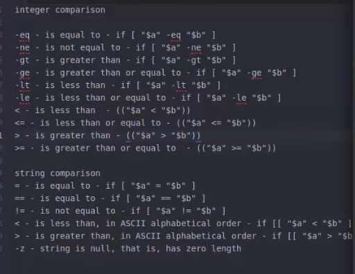

## 1.1.  Variables  
#### 1.1.1 system variables

```bash
#!/bin/bash
echo our shell name is $BASH
echo our shell version is $BASH_VERSION
echo our home directory is $HOME
echo our current working directory is $PWD
```

result:

```bash
#!/bin/bash

our shell name is /bin/bash
our shell version is 4.4.20(1)-release
our home directory is /home/srx
our current working directory is /home/srx/Work/notes/linux
```

####  1.1.2. user variables

```bash
#!/bin/bash

name=Mark
val=10
echo the name is $name
echo value is $val
```

result is :

```bash
the name is Mark
value is 10
```

__PAY ATTENTION__

dont add blank around "=", or it will failed, for ex:

```bash
#! /bin/bash

name = Mark #has blank,error!
val = 10    #has blank,error!
name=Mark   #no  blank,OK!
val=10      #no  blank,OK!
```

## 


## 1.3 Read User Input

### 1.3.1 read one input

```bash
#!/bin/bash

echo "Enter name : "
read name
echo "Entered name: $name"
```

the output is:

```bash
Enter name : 
hala
Entered name: hala
```

### 1.3.2  read multi params

```bash
#!/bin/bash

echo Enter name : 
read name1 name2 name3
echo "Names: $name1 , $name2, $name3"
echo Names: $name1 , $name2, $name3
```

the output is:

```bash
Enter name :
a b c
Names: a , b, c
Names: a , b, c
```

### 1.3.3  read -p/-sp  for not change line and passwod

```bash
#!/bin/bash

read -p 'usrname : ' usr_name
read -sp 'pwd : ' usr_pwd
echo
echo 'usrname : ' $usr_name
echo 'pwd : ' $usr_pwd

```

the output is:

```
usrname : sonder  #wont change a new line to input username
pwd :                #can input but cant be seen
usrname :  sonder
pwd :  123235465

```

### 1.3.4  read all inputs

```bash
#!/bin/bash

echo "Enter names : "
read -a names
echo "Names:" ${names[0]},${names[1]}
echo "Names: ${names[0]},${names[1]}"
```

the output is:

````
Enter names : 
tom jonh tix
Names: tom,jonh
Names: tom,jonh
Names: ${names[0]},${names[1]}
````

### 1.3.5  read default input

```echo
#!/bin/bash

echo "Enter names : "
read 
echo "Name:" $REPLY #only '$REPLY' works
```

the output is:

```bash
Enter names : 
AHSDKFLHA
Name: AHSDKFLHA
```


## 1.4 pass argument to a bash-script

```bash
#!/bin/bash

echo $0 $1 $2 $3  ' > echo $0 $1 $2 $3'

args=("$@")

echo ${args[0]} ${args[1]} ${args[2]} ${args[3]}  
echo ${args[0]} ${args[1]} ${args[2]} ${args[3]}  ${args[4]}  ${args[5]}
echo $@ #echo all the params except [0]
echo $#   #the number of argument pass to the bash
```

the output is:

```bash
srx@ipp:~/Work/notes/linux$ ./test.sh  7 b8 adf iy
./test.sh 7 b8 adf  > echo $0 $1 $2 $3
7 b8 adf iy
7 b8 adf iy  #same as above,the args[4] and args[5] is not here because not input by the user.
7 b8 adf iy
4
```

## 1.5 If Statement ( If / If-then / If-elif-else)

SEE THE GRAPH BELOW:

WE HAVE interger comparison and string comparising !




### 1.5.1 -eq

```bash
#!/bin/bash

 count=10

if [ $count -eq 10 ]
then
    echo "condition is true"
fi
```

the output is:

```bash
condition is true
```

### 1.5.2 -ne

```bash
#!/bin/bash

 count=10

if [ $count -ne 9 ]
then
    echo "condition is true"
fi
```

the output is:

```bash
condition is true
```

### 1.5.3     >

```bash
#!/bin/bash

 count=10

if [ $count > 9 ]
then
    echo "condition is true"
fi
```

the output is:

```bash
condition is true
```

ETC...

### 1.5.4     == / =

```bash
#!/bin/bash

word=abc

if [ $word == "abc" ]
#if [ $word = "abc" ] # singal = also works

then
    echo "condition is true"
fi
```

the output is:

```bash
condition is true
```

### 1.5.5    <   

compare the ASCII value

the [ ] cant work

```bash
#!/bin/bash

word=abc

if [ $word < "bbc" ]
then
    echo "condition is true"
fi
```

the output is :

```bash
./test.sh: line 5: bbc: No such file or directory
```

BUT [[ ]] works :

```bash
#!/bin/bash

word=abc

if [[ $word < "bbc" ]]
then
    echo "condition is true"
fi
```

the output is:

```bash
condition is true
```


__** TIPS**__:

the [[ ]] means : when campare strings in bash, trans the value in ASCII alphabetical order. so ,when you compare strints and  use "<" , ">" , you use "[[ ]]" ,but when you use "==","=", or "!=", you dont need to use "[[ ]]" , "[ ]" also works. 

### 1.5.6   !=

```bash
#!/bin/bash

word=abc

if [ $word != "bbb" ]  # the [] and [[]] all works
then
    echo "condition  is true"
fi
```

the output is:

```bash
condition  is true
```


### 1.5.7 else / elif

```bash
#!/bin/bash

word=a

if [[ $word = "b" ]]
then
    echo "condition b is true"
elif [[ $word == "a" ]] #has a blank after right "
#elif [[ $word == "a"]]  #error, becaue no blank after right "
then
    echo "condition a is true"
else 
    echo "condition is false"
fi
```

the output is:

```bash
condition a is true
```

### 1.5.8       -z

```bash
#!/bin/bash

word=""

if [ $word -z ]
then
    echo " condition  is true"
fi
```

the output is:

```bash
 condition  is true
```


## 1.6 File test operators

#### 1.6.1   -e (exists)

```bash
#!/bin/bash

echo  -e "Enter the name of file :\c"  # this e means '\' in '\c' will be interpretor rather than echo by a normal string, the '\c' wont make a next line, so user can input the file name in the same bash line.
read file_name

if [ -e $file_name ] #if exist
then
    echo "$file_name found"
else
    echo "$file_name not found"
fi
```

now ,if i touch a agb in current bash script dir, the  output is:

```bash
Enter the name of file :abg
abg found
```


#### 1.6.2  -f (is a regular file)

```bash
#!/bin/bash

echo  -e "Enter the name of file :\c"
read file_name

if [ -f $file_name ] # check if a regular file or not.
then
    echo "$file_name found"
else
    echo "$file_name not found"
fi
```

now if you mkdir a abg_dir, the output is:

```bash
Enter the name of file :abg_dir
abg_dir not found
```


#### 1.6.3    -d (is a directory or not)

```bash
#!/bin/bash

echo  -e "Enter the name of file :\c"
read file_name

if [ -d $file_name ]
then
    echo "$file_name found"
else
    echo "$file_name not found"
fi
```

now if you mkdir a abg_dir, the output is:

```
Enter the name of file :abg_dir
abg_dir not found
```


#### 1.6.4   -b (is a binrary file)

if a jpg,video, it's -b

#### 1.6.5    -c (?)

galleary ?

#### 1.6.6  -s (is not empty)

```bash
#!/bin/bash

echo  -e "Enter the name of file :\c"
read file_name

if [ -s $file_name ]
then
    echo "$file_name is not empty"
else
    echo "$file_name is empty"
fi
```

if the filename is not exist, it's empty. 

if you vim the file as some charators , its not empty

#### 1.6.7     -r / -w / -x  

if the filename has a read /write /execute permission.

```bash
#!/bin/bash

echo  -e "Enter the name of file :\c"
read file_name

if [ -r $file_name ]
then
    echo "$file_name can be read"
else
    echo "$file_name can not be read"
fi
```

if the file has the read permission, the output is :

```bash
Enter the name of file :abg
abg can be read
```


