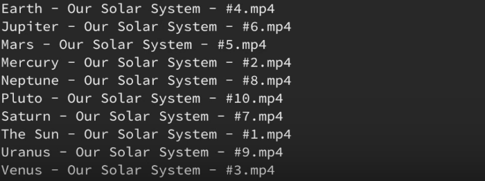

if we  have some videos in our pc unsorted,and we want to rename them to make the order number at the begining of  the filename rather than the end. 

the unsorted video list looks like :



for convenience,we use "tesseract-ocr" to extract text from image,the text are:

```
Earth - Our Solar System - #4.mp4
Jupiter - Our Solar System - #6.mp4
mars - Our Solar System - #5.mp4
mercury - Our Solar System - #2.mp4
Neptune - Our Solar System - #8.mp4
Pluto - Our Solar System - #l0.mp4
Saturn - Our Solar System - #7.mp4
The Su_ - Our Solar System - #1.mp4
Uranus - Our Solar System - #9.mp4
Venus - Our Solar System - #3.mp4
```

