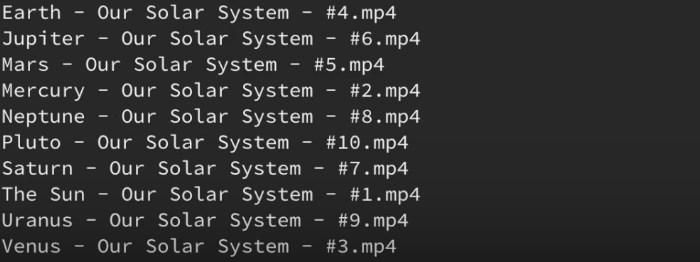

if we  have some videos in our pc unsorted,and we want to rename them to make the order number at the begining of  the filename rather than the end. 

the unsorted video list looks like :



for convenience,we use "tesseract-ocr" to extract text from image,the text are:

```
Earth - Our Solar System - #4.mp4
Jupiter - Our Solar System - #6.mp4
mars - Our Solar System - #5.mp4
mercury - Our Solar System - #2.mp4
Neptune - Our Solar System - #8.mp4
Pluto - Our Solar System - #l0.mp4
Saturn - Our Solar System - #7.mp4
The Su_ - Our Solar System - #1.mp4
Uranus - Our Solar System - #9.mp4
Venus - Our Solar System - #3.mp4
```

### code :

```python
import os

os.chdir('/home/srx/Work/tmp/videos')

print(os.getcwd()) #show current work directory

for f in os.listdir(): #list all the files AND directories
    print(os.path.splitext(f))     # ==> ('Pluto - Our Solar System - #10', '.mp4')

    file_name,file_ext = os.path.splitext(f)
    print(file_name)               # ==> Pluto - Our Solar System - #10
    print(os.path.splitext(f)[0])  # ==> Pluto - Our Solar System - #10
    print(file_ext)                # ==> .mp4 (not mp4,but '.mp4')

    print(file_name.split('-'))    # ==> ['Pluto ', ' Our Solar System ', ' #10']

    f_title, f_cource, f_num = file_name.split('-')

    f_title  = f_title.strip()  # trim the space
    f_cource = f_cource.strip()
    f_num_2  = f_num.strip()
    f_num_3  = f_num.strip()[1:] # extract string from index 1
    f_num    = f_num.strip()[1:].zfill(3) # extract string from index 1 ,then fill 3 digit zero as format

    print(f_title)                 # ==> Pluto
    print(f_cource)                # ==> Our Solar System
    print(f_num_2)                 # ==> #10
    print(f_num_3)                 # ==> 10
    print(f_num)                   # ==> 010 (001,002,008,etc)
    print('{}-{}-{}{}'.format(f_num, f_cource, f_title, file_ext))   # ==> #10-Our Solar System-Pluto.mp4
    print('{}-{}{}'.format(f_num, f_title, file_ext))   # ==> 010-Pluto.mp4
    
    new_name = '{}-{}{}'.format(f_num, f_title, file_ext)
    
    os.rename(f, new_name)   # rename the files, after rename, the file can be orded list aotumaticlly by os


```


